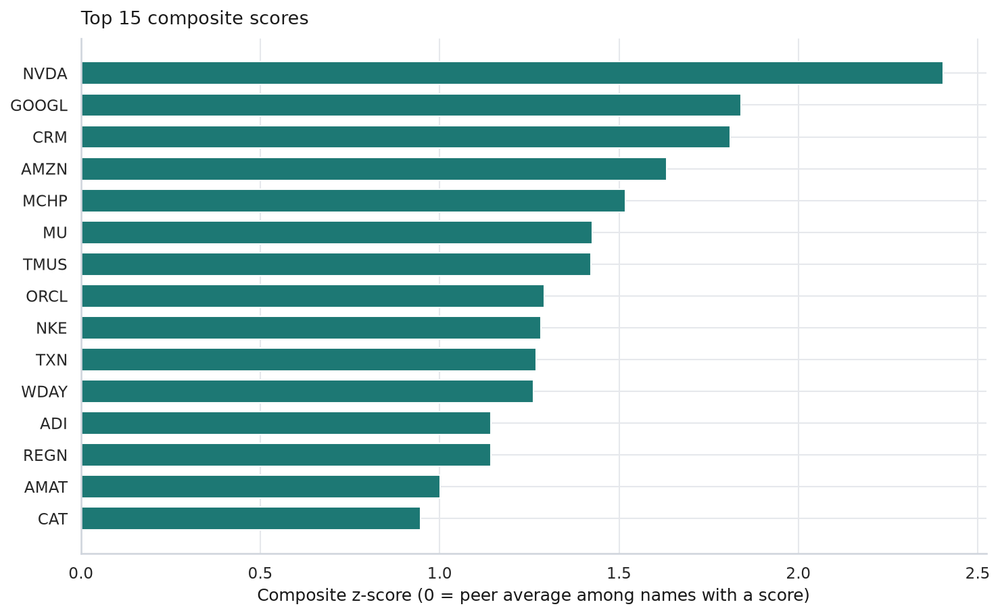
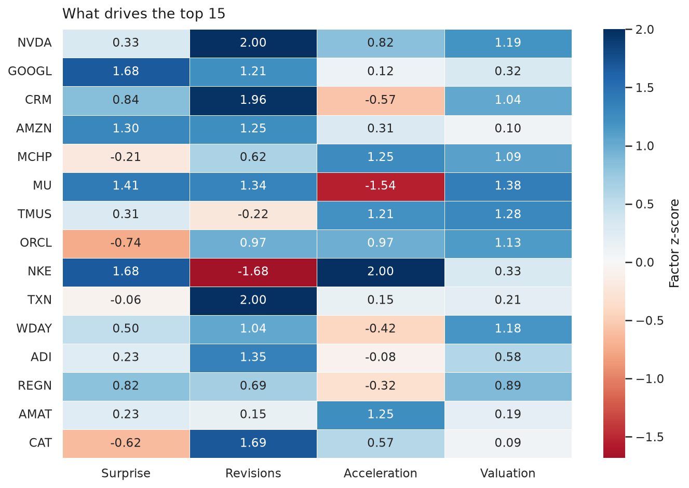
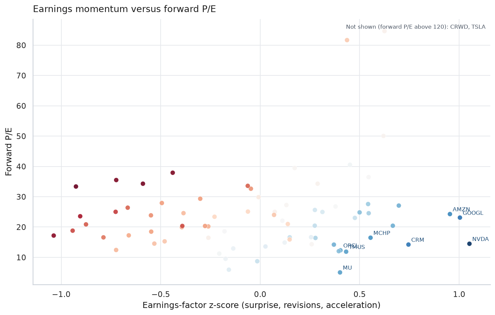
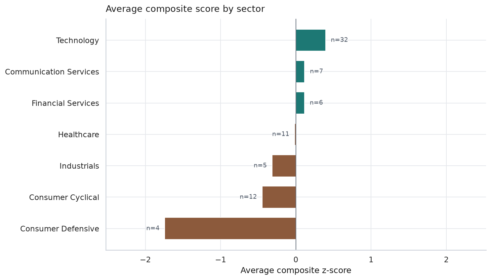
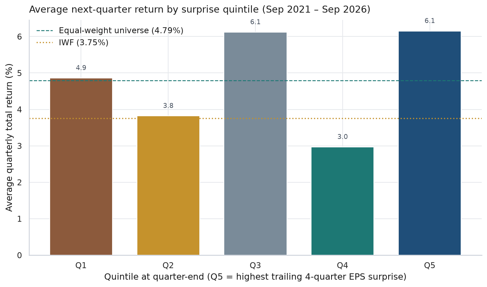
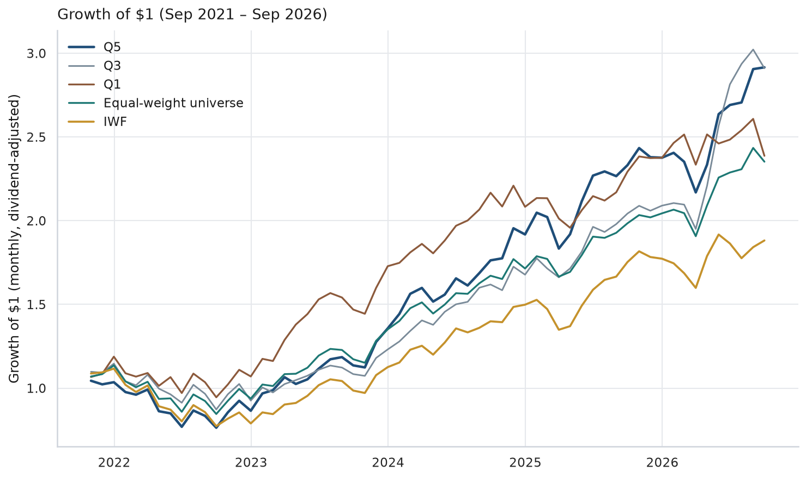

# Earnings revision screen

**As of 8 October 2026.** An educational screen of 77 U.S. large-cap growth stocks. It ranks names on trailing EPS surprises, the current path of consensus EPS estimates, EPS growth acceleration, and a growth-at-a-reasonable-price valuation check. A separate backtest asks whether trailing EPS surprises, using only information known at each quarter-end, lined up with later returns.

This is a study project for interview practice. It is not a recommendation to buy or sell any security, and it is not a description of any firm's live process.

The reproducible code is `earnings_screen.py`. The walkthrough with saved output is `earnings_revision_screen.ipynb`. Study notes are in `INTERVIEW-NOTES.md`.

## The question

A long-only U.S. large-cap growth process, measured against the Russell 1000 Growth, often starts with a simple earnings story:

1. Are companies beating the consensus EPS estimate, and is that a habit rather than a one-off?
2. Are analysts raising estimates, or cutting them?
3. Is the EPS growth rate speeding up?
4. Is the valuation still reasonable for that growth?

The project builds that ranking with free data, then tests the one piece that free history can actually support: past EPS surprises.

## The short answer

On the 8 October 2026 snapshot, the highest composite scores are **NVIDIA, Alphabet, Salesforce, Amazon, and Microchip Technology**. NVIDIA and Texas Instruments are there because a large share of analysts have raised estimates in the last 30 days. Salesforce is there for the same reason, plus a forward P/E near 14. Alphabet and Amazon score well on surprises and on a big 90-day lift in the *current-year* EPS estimate; next year's estimate is lower than this year's, so the growth-acceleration leg does not confirm the story. Nike ranks 9th only because depressed EPS makes both the surprise percentage and the "acceleration" look large, while the 90-day revision is the worst in the universe (about −26%). Micron screens as very cheap on a forward P/E near 5 because current-year earnings estimates are extremely high.

The historical test is modest, and it should stay modest. From 30 September 2021 through 30 September 2026 (20 quarters), the highest trailing-surprise quintile compounded at **23.9%** a year. The equal-weight universe compounded at **18.7%**. IWF, the Russell 1000 Growth ETF used here as the benchmark proxy, compounded at **13.5%**. The top quintile beat IWF in 15 of 20 quarters. It beat the equal-weight universe in only 11 of 20 quarters. The third quintile compounded at **23.8%**, almost the same as the top quintile. The average gap between the top and bottom quintile was **1.3 percentage points per quarter**, with a descriptive t-statistic of **0.6**. A time-split regression of next-quarter excess return on the surprise score has an out-of-sample R² of about **zero**.

Read that as: in this short survivor sample, the high-surprise basket finished ahead of an equal-weight basket of the same names and ahead of IWF. The path is uneven, the middle of the ranking did about as well as the top, and the early half of the sample does not match the later half. That is too little to treat trailing EPS surprise as a proven return premium.

## Universe

The universe is the 77 tickers in `data/universe.csv`. It is a fixed list chosen for this project in October 2026, not an official index membership file.

Rules used to build it:

- U.S. issuer, U.S.-listed common stock.
- Large-cap growth profile: the kind of company that commonly sits among the larger holdings of the Nasdaq-100 and the Russell 1000 Growth (software, semiconductors, internet platforms, innovative health care, payments, and a few established compounders).
- Sector spread wide enough that the screen has to choose, including a few slower growers so "expensive and no estimate momentum" can actually show up at the bottom.
- Static list, so the project re-runs without scraping an index provider.

Three well-known U.S.-listed companies that are incorporated abroad (NXP, Medtronic, Eaton) were downloaded with the first pull and then left out of the study. Russell 1000 Growth is a U.S. universe. Their rows are still in the raw cache. They are not in the scores or the backtest.

Sectors below are Yahoo Finance sectors. Technology is 32 of 77 names (42%). The top 20 scores are 60% technology, so the screen leans further that way than the starting list. Consumer defensive is four names, and none of them land in the top 20.

## Data

Everything quoted here comes from the CSV cache in `data/raw/`, downloaded from Yahoo Finance on **8 October 2026**. Re-running the notebook uses that cache. Prices run from 2 January 2020 through 8 October 2026 and are split- and dividend-adjusted.

| Input | What it is | History available for free |
| --- | --- | --- |
| Quarterly EPS estimate, reported EPS, surprise % | The consensus just ahead of the print, versus what was reported | About October 2020 through October 2026 for this universe. One older fragment was dropped (see below). |
| EPS trend | Current consensus versus 7, 30, 60, and 90 days ago, for this year and next year | **Current snapshot only.** There is no free history of how the consensus stood on past dates. |
| EPS revisions | Count of analysts who raised or cut, last 7 and 30 days | **Current snapshot only.** |
| Forward P/E, PEG, market cap, sector | Vendor snapshot | **Current snapshot only.** |
| Daily adjusted close, including IWF | Total-return-style price | Full window above. |

Cleaned tables live in `data/earnings_screen.db` (SQLite): `universe`, `earnings`, `prices_monthly`, `scores`, `backtest_members`, `backtest_quarterly`.

### What the cleaning does

- A print timestamp at or after 4:00 p.m. New York time is treated as after the close. It becomes usable on the next business day. A morning print is usable the same day. The backtest refuses any surprise whose available date is after the rebalance date (the check comes out to zero days of lead).
- Surprise % is recomputed as `(reported − estimate) / estimate × 100`. Against Yahoo's own surprise field, the median absolute difference is **0.15 percentage points**, so the formula matches the vendor.
- Rows with a missing, negative, or sub-$0.05 estimate are dropped (**55** rows). Percentages on a penny estimate, or on a loss, are not usable.
- Remaining surprises outside **±25%** are capped (**191** of **1,784** usable prints). Past that, the percentage is usually a tiny denominator or a one-time item.
- Prints before 2019 are dropped. BlackRock's vendor history had a 2008–2009 fragment and then jumped to 2022. Year-over-year growth is also matched on the calendar (a print about 365 days earlier, within 300–450 days), so a gap cannot be treated as "four quarters ago."
- Usable surprise history in the study runs from **14 October 2020** to **1 October 2026**.
- The median stock beat in **87.5%** of its last eight usable quarters. The median average capped surprise is about **6.1%**. Large companies beat conservative estimates often. In this peer group the yes/no beat rate is a weak separator. The size of the beat, and the revision, do more work.

### What free data cannot do

The live screen uses the revision snapshot and the valuation snapshot. Those cannot be rolled back to 2022. Yahoo does not provide a point-in-time history of consensus EPS, of forward P/E, or of index membership. The backtest therefore uses **only trailing reported surprises**, which are known on the announcement date. It does not pretend to test the four-factor composite.

The reported EPS series is not a clean "adjusted" EPS. A single unusual quarter can move the trailing surprise and the current-year consensus together. Alphabet's July 2026 print in this feed is an example: reported EPS was far above the estimate, the current-year consensus ($20.63) now sits above next year's ($14.95), and forward "growth" is negative. The file does not say whether that quarter includes a one-time item.

## Method

Four factors. Each ingredient is winsorized at the 5th and 95th percentile of this universe, turned into a z-score (mean 0, standard deviation 1, using the population standard deviation), and combined inside its factor. The factor z-score is clipped at **±2**, so one strange reading cannot outvote the other three. The composite is the equal-weight average of the four factor z-scores, z-scored once more so that 0 is the peer average. Rank 1 is the highest composite. Every name had at least three factors, so all 77 receive a rank.

| Factor | Ingredients | Direction |
| --- | --- | --- |
| Surprise consistency | Average capped surprise over the last 8 quarters, and the share of those quarters that were beats | Higher is better |
| Estimate revisions | Percent change in the consensus versus 90 days ago, averaged for this fiscal year and next year; plus 30-day upgrade/downgrade breadth on this fiscal year | Higher is better |
| EPS growth acceleration | Change in reported year-over-year EPS growth (each growth rate capped at ±100%), and the gap between next year's consensus growth and this year's (each capped at ±40%) | Higher means the growth rate is speeding up |
| Valuation (GARP) | Forward P/E, kept only if it is positive and below 250; PEG, kept only if it is positive and below 10 | Lower multiple is better, so the sign is flipped before the z-score |

A z-score of +1 means "one standard deviation above the peer average on that factor," after the cap. Clipping at 2 means "this is an extreme reading" and then stops.

Acceleration is the change in the growth *rate*, not the level of growth. A company can be growing quickly and still score poorly on acceleration if next year's growth rate is lower than this year's. PEG already carries the level of expected growth inside the valuation factor. The 40% cap on consensus growth is there so a 90% versus 70% comparison, which is still fast growth in both years, does not dominate the score. NVIDIA is in that situation: both years are above the cap, so the forward-acceleration ingredient is zero, and the revision factor carries the name.

## The live screen







CrowdStrike (forward P/E about 164) and Tesla (about 175) sit above the top of the scatter so the rest of the cloud stays readable.



Composite z-scores average to zero across the whole universe by construction. The sector chart is the tilt around that average. Technology is the positive tilt. Consumer defensive is the negative tilt, on only four names.

### Top 10 on 8 October 2026

| Rank | Ticker | Company | Surprise | Revisions | Acceleration | Valuation | 90-day revision | Forward P/E | PEG |
| ---: | --- | --- | ---: | ---: | ---: | ---: | ---: | ---: | ---: |
| 1 | NVDA | NVIDIA | 0.33 | 2.00 | 0.82 | 1.19 | +14.7% | 14.5 | 0.29 |
| 2 | GOOGL | Alphabet | 1.68 | 1.21 | 0.12 | 0.32 | +23.9% | 23.1 | 1.24 |
| 3 | CRM | Salesforce | 0.84 | 1.96 | −0.57 | 1.04 | +10.9% | 14.2 | 0.80 |
| 4 | AMZN | Amazon | 1.30 | 1.25 | 0.31 | 0.10 | +26.9% | 24.3 | 1.52 |
| 5 | MCHP | Microchip Technology | −0.21 | 0.62 | 1.25 | 1.09 | +13.4% | 16.5 | 0.24 |
| 6 | MU | Micron Technology | 1.41 | 1.34 | −1.54 | 1.38 | +21.9% | 5.0 | 0.16 |
| 7 | TMUS | T-Mobile US | 0.31 | −0.22 | 1.21 | 1.28 | +4.1% | 11.9 | 0.59 |
| 8 | ORCL | Oracle | −0.74 | 0.97 | 0.97 | 1.13 | +0.9% | 12.3 | 0.81 |
| 9 | NKE | Nike | 1.68 | −1.68 | 2.00 | 0.33 | −26.3% | 20.4 | 1.47 |
| 10 | TXN | Texas Instruments | −0.06 | 2.00 | 0.15 | 0.21 | +12.3% | 27.1 | 1.06 |

Factor columns are capped z-scores. Full precision is in `data/scores.csv`.

Names at the bottom of the same ranking include Monster Beverage, Walmart, Tesla, Apple, and Costco. Apple is the useful example: trailing surprises are ordinary versus this peer group, the 90-day change in the consensus is about flat (−0.2%), and the forward P/E is about 35. The screen is measuring those inputs. It is not a business-quality score, and a low rank is not a forecast that the business is deteriorating.

## Backtest

At each quarter-end from **30 September 2021** through **30 June 2026**, each stock with four already-reported usable surprises gets a signal: the average capped surprise over those four quarters. Stocks are sorted into five equal-weight quintiles. Quintile 5 is the highest trailing surprise. The portfolio is held to the next quarter-end, through **30 September 2026** (20 quarters, 60 months). Weights start equal and drift during the quarter. The same dates are used for the equal-weight universe (every name with a signal that quarter, about 15 names per quintile) and for IWF.

No surprise enters the signal before its available date. Valuation and estimate revisions are not in this test, because the free feed has no history for them.





Q3 is on the wealth chart because it finished almost on top of Q5. Leaving it off would make the top quintile look like the unique winner.

| Portfolio | CAGR | Volatility | Sharpe (rf = 0) | Max drawdown | Quarters up | Beat equal-weight | Beat IWF | Avg. quarter |
| --- | ---: | ---: | ---: | ---: | ---: | ---: | ---: | ---: |
| Q5 highest surprise | 23.9% | 21.0% | 1.13 | −26.9% | 75% | 55% | 75% | 6.15% |
| Q4 | 10.2% | 19.3% | 0.60 | −30.7% | 65% | 30% | 50% | 2.97% |
| Q3 | 23.8% | 19.8% | 1.18 | −23.9% | 70% | 60% | 65% | 6.12% |
| Q2 | 14.4% | 17.8% | 0.85 | −28.6% | 60% | 30% | 55% | 3.82% |
| Q1 lowest surprise | 19.0% | 18.6% | 1.03 | −20.4% | 60% | 60% | 60% | 4.86% |
| Equal-weight universe | 18.7% | 17.8% | 1.05 | −25.6% | 70% | — | 75% | 4.79% |
| IWF | 13.5% | 19.3% | 0.75 | −30.7% | 70% | — | — | 3.75% |

Definitions, so the table can be checked:

- **CAGR** is the compound growth of the monthly wealth curve, annualized.
- **Volatility** is the standard deviation of monthly returns, times √12.
- **Sharpe (rf = 0)** is the average monthly return divided by its standard deviation, times √12. The risk-free rate is zero. Over 2021–2026, T-bills paid more than zero, so this number is higher than a textbook excess-return Sharpe.
- **Max drawdown** is the deepest peak-to-trough loss on the monthly wealth curve. A daily curve would be at least as deep.
- **Quarters up** is the share of the 20 quarters with a positive return.
- **Beat equal-weight / beat IWF** is the share of quarters with a higher return than that comparison.

The Q5 minus Q1 gap averages 1.3 percentage points per quarter (descriptive t-statistic 0.6). Before the 31 March 2024 rebalance, that gap in excess return was about **−1.3** percentage points per quarter. From that date forward it was about **+4.0**. A scikit-learn linear regression of next-quarter return minus the equal-weight universe, fit on the earlier rebalance dates and scored on the later ones, has a test R² of about zero. The full-sample slope is about **0.12 percentage points** of excess return per one-standard-deviation higher surprise score. The rank correlation between the surprise score and excess return is about **−0.01**.

Two comparisons matter, and they answer different questions.

- **Q5 versus the equal-weight universe** asks whether the surprise sort added anything inside this list. The CAGR gap is 23.9% versus 18.7%. The quarter-by-quarter win rate is 55%. Q3 matched Q5. The sort is a mild, unstable tilt.
- **Either of those versus IWF** mixes the surprise sort with equal weight, with a static survivor list, and with an ETF that is cap-weighted and charged a fee. The equal-weight universe itself beat IWF in 75% of quarters (18.7% versus 13.5% CAGR). Most of the gap versus IWF is the universe, not the quintile sort.

## Investment memo

*Educational write-up of the 8 October 2026 screen. Not a recommendation. Not investment advice. Prices and consensus figures are the Yahoo Finance snapshot in the cache.*

**Purpose.** Produce a first-pass list for a U.S. large-cap growth coverage universe, using earnings momentum and a valuation check, and flag where the factors disagree.

**What the top of the list is saying.**

**NVIDIA (rank 1).** The revision leg is at the +2 cap. Over the prior 30 days, 43 analysts raised the current-year EPS estimate and 1 cut it, out of 51 covering the year. The 90-day change in the consensus, averaged across this year and next year, is about +15%. Trailing surprises are steady rather than huge: about +5.6% on average, and a beat in each of the last eight usable quarters. Next-year consensus EPS is $15.91 against $9.31 for this year (vendor growth about 71%). Both growth rates sit above the 40% cap, so forward acceleration adds nothing by design. The forward P/E is about 14.5 and the PEG is about 0.29, which looks inexpensive because the growth rate in the denominator is very high. The next analytical step is to test how much of that revision path is already in the price, and what the multiple looks like if the upgrade cycle pauses. The screen does not answer that.

**Alphabet (rank 2).** Trailing capped surprises average about +16%, with a beat in each of the last eight usable quarters, and the 90-day revision is about +24%. The 30-day breadth is quiet (5 raises and 3 cuts). This year's consensus EPS is $20.63 and next year's is $14.95, so the vendor's forward growth rate is about −28%. That pattern lines up with a very large reported beat in the recent history, and the feed does not separate one-time items from run-rate EPS. Forward P/E is about 23 and PEG about 1.2. An analyst would rebuild the EPS bridge before treating the current-year number as a base.

**Salesforce (rank 3).** This is a cleaner revision case. Over 30 days, 48 analysts raised the current-year estimate and none cut it (52 cover the year). The 90-day consensus change is about +11%. Forward P/E is about 14.2 and PEG about 0.8, so the valuation leg agrees. Acceleration does not: next year's EPS estimate is $16.02 against $16.75 this year. The stock screens well on revisions and the multiple, not on speeding growth.

**Amazon (rank 4).** Similar shape to Alphabet. The 90-day revision is about +27%, but that average is mostly the current-year estimate moving up (consensus EPS $12.89 this year versus $10.53 next year). Only 3 analysts changed the current-year number in the last 30 days. Trailing surprises are high (capped average about +21%). Forward P/E is about 24, so valuation is near the middle of this peer group. Same follow-up as Alphabet: is the current-year EPS a run rate?

**Microchip Technology (rank 5).** The score is acceleration plus valuation, not a surprise story (surprise z-score −0.21, about +4.4% average capped surprise). The 90-day revision is about +13%, with no analyst changes in the last 30 days, so the move is older than a month. Forward P/E is about 16.5 and PEG about 0.24. Consensus EPS steps up from $3.65 this year to $4.58 next year. It is a semiconductor name, so the cycle still has to be part of the work.

**Where the factors argue, and the list should not be handed over raw.**

**Micron (rank 6)** has rising estimates (90-day revision about +22%) and a forward P/E near 5. Quarterly reported EPS in this history goes from losses in 2023 to about $33 in the latest print, and the current-year consensus is about $176. A forward P/E on peak cyclical earnings is a low number by arithmetic. The acceleration z-score is −1.54, which is the model saying the growth rate off that peak is expected to slow (next-year growth in the vendor file is about 17%, against a much hotter current year). Normalizing earnings comes before trusting the multiple.

**Nike (rank 9)** is the disagreement the heatmap is meant to show. Surprise z-score +1.68 and acceleration at the +2 cap. Revision z-score −1.68. The current-year consensus fell from about $1.73 to $1.29 over 90 days. Over the last 30 days, 7 analysts cut and 1 raised. Beating a lowered bar by a large percentage, and showing a higher growth rate off a depressed base (next year $1.65 versus a year-ago EPS near $2.10), is not the same thing as positive estimate momentum. The revision column would stop this name in a process that requires rising estimates.

**Tesla (rank 76)** is the other end: forward P/E about 175, 90-day revision about −17%, surprise z-score at the −2 floor. It is off the scatter because the multiple compresses everyone else.

**What an analyst would do next, and what this project does not do.** Read the last two earnings releases and the estimate bridge for any name that survives the revision check (NVIDIA, Salesforce, Texas Instruments are the cleanest upgrade stories on this date). Decide whether a low multiple is peak earnings (Micron) or run-rate earnings (Salesforce is the question to test, not the answer). Sector concentration is real: 12 of the top 20 are technology. A live book would add position limits, a sector budget, and liquidity. None of that is in the rank.

## Limitations

- Revisions, forward P/E, and PEG are one day's snapshot. They are not a backtest.
- Surprise history starts in late 2020. Twenty quarters is a short sample. One regime can dominate it, and in this window the second half does not look like the first.
- The universe is today's survivors. Companies that stopped being large-cap growth names are absent. That lifts the return of every portfolio built from this list, including the equal-weight comparison. IWF was a live cap-weighted ETF the whole time, so it is not the same object. Compare quintiles to the equal-weight universe first.
- IWF is an ETF proxy for the Russell 1000 Growth index. It has a fee, tracking difference, and cap weights. It is not the index.
- There are no transaction costs, no borrow, no sector neutrality, and no cap on a single name. Drawdowns are monthly.
- The Sharpe ratio uses a zero risk-free rate.
- Yahoo's EPS is not guaranteed to be the adjusted figure a desk would use. One-time items leak into surprises and into the current-year consensus.
- Winsorizing, the 25% surprise cap, the 40% growth cap, and the z-score cap of 2 are choices. They change ranks at the edges (Nike in particular). They are documented so the choice can be defended, and so it can be changed.
- Business-day logic skips weekends and does not skip exchange holidays. A print on the afternoon before a holiday can be off by one session. At a quarterly horizon that is small.

## How to run

From this folder, with the packages in `requirements.txt`:

```bash
pip install -r requirements.txt
python earnings_screen.py
jupyter nbconvert --to notebook --execute earnings_revision_screen.ipynb --inplace
```

`earnings_screen.py` reads `data/raw/` and rebuilds the SQLite database, the score table, the charts, and `data/results_summary.json`. It does not call the network unless you change the last line to `run(force_download=True)`. The notebook calls the same pipeline, then runs the SQL and reprints the tables.

## Files

| Path | Role |
| --- | --- |
| `earnings_screen.py` | Download (optional), clean, score, backtest, charts, database |
| `earnings_revision_screen.ipynb` | Narrative, SQL, and saved output |
| `INTERVIEW-NOTES.md` | Plain-language walkthrough and likely questions |
| `data/universe.csv` | The 77 names |
| `data/raw/` | Cached vendor files |
| `data/earnings_screen.db` | Cleaned SQLite database |
| `data/scores.csv` | Full ranking |
| `data/backtest_stats.csv` | Performance table |
| `images/` | The six charts |
