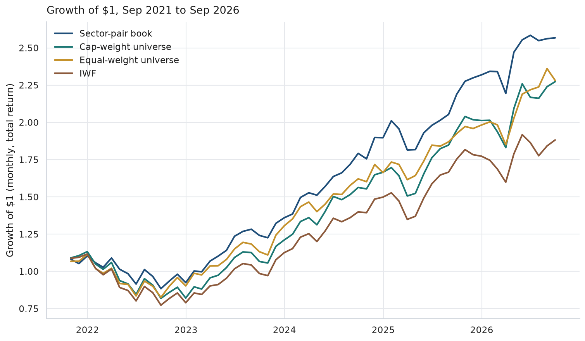
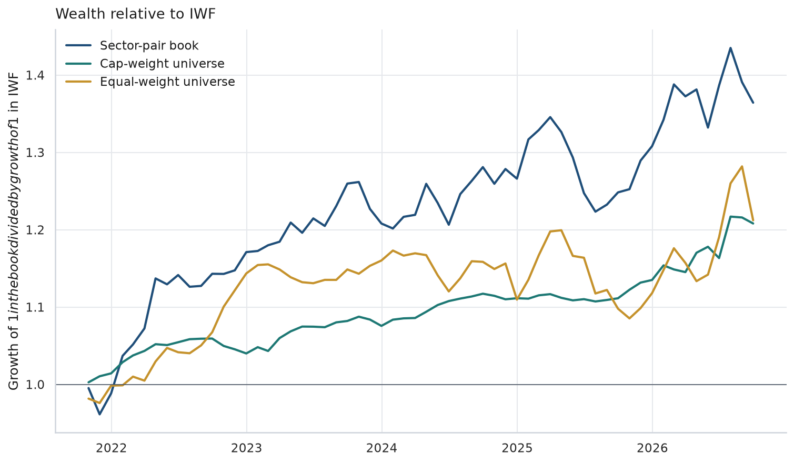
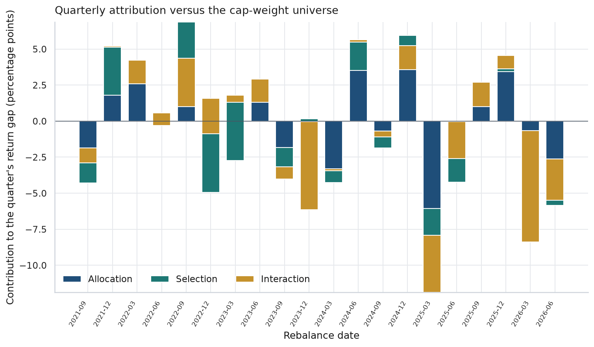
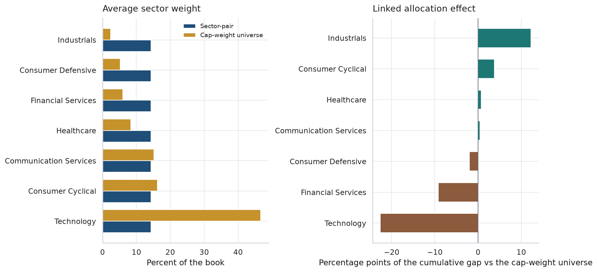
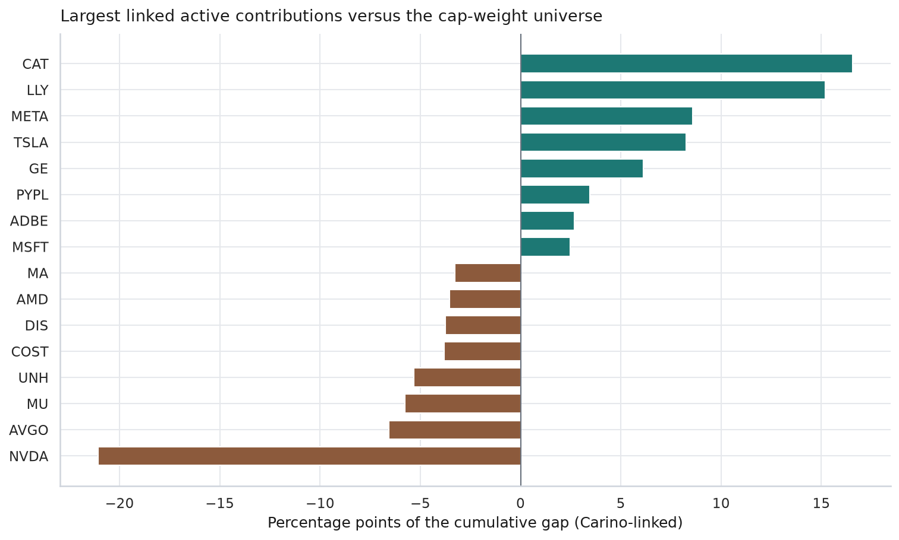
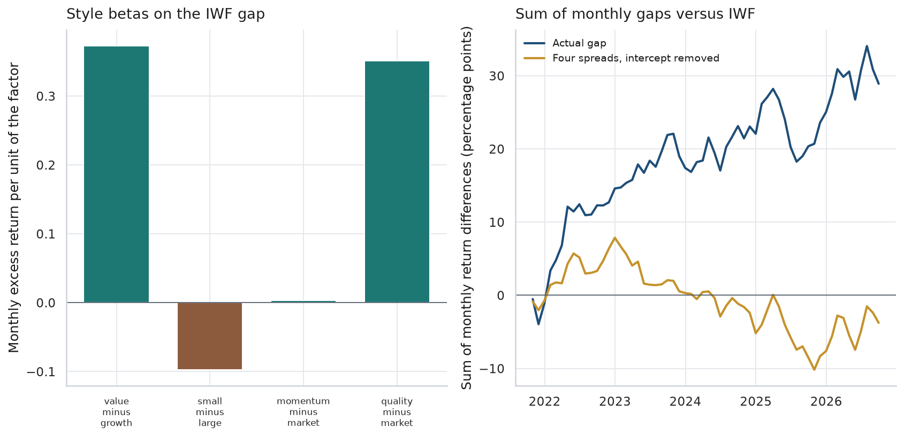

# Portfolio attribution versus the Russell 1000 Growth

**Prices through 8 October 2026. Study window 30 September 2021 through 30 September 2026.** An educational attribution of a simple rules-based U.S. large-cap growth portfolio. The portfolio holds the two largest companies in each sector of a fixed 77-name coverage list, equal-weighted, and reforms the book at each quarter-end. The question is how much of its return gap versus IWF, the iShares Russell 1000 Growth ETF, is sector weights, stock selection, and a handful of style-factor ETF spreads.

This is a study project for interview practice. It is not a recommendation to buy or sell any security.

The reproducible code is `attribution.py`. The walkthrough with saved output is `portfolio_attribution.ipynb`. The one-page note is `MEMO.md`. Study notes are in `INTERVIEW-NOTES.md`.

## The question

A large-cap growth book is usually judged against the Russell 1000 Growth. Three different sentences get collapsed into "we beat the benchmark":

1. Did the sector weights differ from a cap-weighted book, and did those sectors then lead or lag?
2. Inside a sector, did the names we held do better than the names we could have held?
3. Does the whole gap look like a known style, such as value versus growth, size, momentum, or quality?

The project separates those sentences. It uses free data, and it says where free data runs out.

## The short answer

From 30 September 2021 through 30 September 2026 (20 quarters, 60 months), the sector-pair book compounded at **20.8%** a year. IWF compounded at **13.5%**. A cap-weighted portfolio of the same 77 names compounded at **17.9%**. An equal-weighted portfolio of those names also compounded at **17.9%**. Total returns were 156.7% for the book, 127.3% for the cap-weighted list, 128.1% for the equal-weighted list, and 88.2% for IWF. The book beat IWF in 14 of 20 quarters. It beat the cap-weighted list in 9 of 20. The average gap versus the cap-weighted list was **0.4 percentage points per quarter**, with a descriptive t-statistic of **0.5**. The average gap versus IWF was **1.4 percentage points per quarter**, with a descriptive t-statistic of **1.6**.

Read the two comparisons separately.

Against the cap-weighted 77, Brinson-Fachler attribution is an identity, and it does not say "the sector bets worked." Linked allocation is **−16.7** percentage points of the cumulative gap. Selection is **−1.0**. Interaction is **+47.1**. They sum to the **+29.4** point difference between 156.7% and 127.3%. The book averaged 14% in technology. The cap-weighted list averaged 47%. Technology's linked total is about **−34** points. NVIDIA is in the book for 6 of the 20 rebalances, first on 31 December 2024. Underweighting NVIDIA is the largest name effect, about **−21** points. Overweighting Caterpillar and Eli Lilly are the largest positive name effects, about **+17** and **+15** points.

Against IWF, the cumulative gap is **68.5** points (156.7% minus 88.2%). In the linked split, about **42** points of that is the cap-weighted 77 beating the ETF. Free data has no history of Russell membership, so that piece is not a stock-level attribution. The 77-name basket moves with IWF (correlation **0.99**, beta **0.99**, tracking error **2.9%** a year) and still finishes ahead. Survivorship is the first place to look. Every name in the file was still a large cap in October 2026. IWF was a live ETF the whole time.

The style regression does not eat the average gap. The book's beta to IWF is **0.79**, so this was not a leveraged copy of the ETF. Four ETF spreads (value minus growth, small minus large, momentum minus the market, quality minus the market) line up with about half the month-to-month variation of the gap: in-sample R² **0.52**, and **0.42** when betas fit on the first 30 months are applied to the next 30. The one solid loading is value minus growth, at **0.37**. Value lagged growth in this window, so that loading subtracted from the average. The intercept is about **6.5** percentage points a year. The spreads describe the path. They do not account for the mean.

## The portfolio

The rule was set as a concentration limit, not as a search for the return that looks best after the fact.

At each quarter-end:

- Start from the 77 names in `data/universe.csv`. It is the same fixed U.S. large-cap growth list as the earnings-revision project. It is not official Russell 1000 Growth membership and it is not the Nasdaq-100.
- In each Yahoo Finance sector, rank names by a market cap known on that date.
- Hold the two largest. If a sector had fewer than two eligible names, hold the ones it has. In this file every sector had two.
- Equal-weight the selected names. With seven sectors that is 14 names, each at 1/14.
- Hold to the next quarter-end. Weights drift. They are not reset each month.
- No transaction costs in the base results. No position limit beyond the rule itself.

The holdings benchmark for the Brinson table is every eligible name in the same 77, weighted by the same market cap. IWF is the external benchmark. An equal-weight of all 77 names is on the performance chart so the sector-pair rule can be compared with "own the whole list equally."

Eighteen names are held at some point. The book is 14 names at every rebalance. The book on 30 June 2026, which is then held through 30 September 2026, is Alphabet, Meta, Amazon, Tesla, Costco, Walmart, Mastercard, Visa, Eli Lilly, UnitedHealth, Caterpillar, GE Aerospace, Apple, and NVIDIA.

Technology is Apple and Microsoft from the first rebalance through 30 September 2024. NVIDIA joins at 31 December 2024, drops out for the 31 March 2025 rebalance (Apple and Microsoft are the pair again), and is back from 30 June 2025. Communication services starts as Alphabet and Disney, and is Alphabet and Meta from 30 June 2022. Consumer cyclical is Amazon and Tesla for all 20 quarters. Health care is Eli Lilly and UnitedHealth for all 20. Financials is Visa and Mastercard for all 20. Consumer defensive is Walmart throughout, with Procter & Gamble until Costco replaces it at 31 December 2024. Industrials is GE and Honeywell at the first rebalance, Caterpillar and Honeywell from 31 December 2021 through 30 September 2023, and Caterpillar and GE from 31 December 2023.

Average one-way turnover is **7.9%** of the book per quarter. Average active share versus the cap-weighted 77 is **51%**. Charging 10 basis points of one-way cost at each rebalance, including an opening charge on the first quarter, reduces the CAGR by about **0.04** percentage points. Costs are not in the tables below.

## Universe

Sectors are Yahoo Finance sectors. Technology is 32 of 77 names. The sector-pair rule forces each sector to 2/14 of the book, so the portfolio does not inherit that concentration. The cap-weighted list does: technology averages **46.6%** of it.

Three well-known U.S.-listed companies that are incorporated abroad were left out of the earnings-revision study and are not in this list either. The benchmark proxy is a U.S. ETF.

## Data

Everything quoted here comes from the cache in `data/raw/`, downloaded from Yahoo Finance on **9 October 2026**. Re-running the notebook uses that cache. Adjusted prices are the total-return series (splits and dividends). They run from 2 January 2020 through 8 October 2026. October 2026 is not a finished month, so the study stops at 30 September 2026. The same month-end rule as the earnings-revision project: if the last trade is more than four days before month-end, that month is dropped.

| Input | What it is | History available for free |
| --- | --- | --- |
| Adjusted close, coverage names and ETFs | Total return | January 2020 through 8 October 2026 |
| Unadjusted close | Split-adjusted price, used for market cap | Same window |
| Shares outstanding | Count on the report date | Point in time, with gaps |
| Split file | Share splits, and a few spinoff factors mixed in | Corporate-action dates |
| Sector, name, snapshot market cap | Vendor snapshot | **Current snapshot only** |
| IWF top holdings and sector weights | Vendor snapshot of the ETF | **Current snapshot only.** Not used in the attribution |

Cleaned tables live in `data/attribution.db` (SQLite): `universe`, `prices_monthly`, `market_cap_monthly`, `holdings`, `sector_attribution`, `sector_linked`, `quarterly_returns`, `monthly_returns`, `contributors`.

### Market cap, without look-ahead in the return

The rank on a rebalance date uses shares outstanding dated on or before that session, times a price on that session. Yahoo's Close is adjusted for every later split in the file. The shares file is the count on the date it prints, and it sometimes updates a few days before or after the ex-date. The code puts the two on one scale. A split that is already in the share count is not applied again. A split that the price file has already baked in, and the share count has not, is applied. The baseline for "pre-split shares" is taken 21 days before the ex-date, so an early print does not become the baseline. Once a later print shows the post-split count, later dates are left alone, which keeps a multi-year buyback from looking like a missing split.

A shares print more than 180 days old is not used. There is an explicit check that any shares date used in a signal is on or before the rebalance.

Yahoo also drops a few spinoff factors into the split file (GE HealthCare and GE Vernova, Danaher's Veralto spinoff, and smaller adjustments for Honeywell, Comcast, and S&P Global). Those rescale the old price. They do not change the share count. For market cap they are reversed, so the price is the one the stock traded at. That is a cleaning step. It does not use the later return.

On the last month in the file, this market cap divided by Yahoo's own market-cap field has a median ratio of **0.99**, a minimum of **0.87**, and a maximum of **1.05**. No name needed the fallback that scales today's market cap by the price path. The script also checks that NVIDIA's September 2021 market cap is a few hundred billion dollars, not a few trillion, and that Apple's is in the low trillions. A split-scale bug fails that check instead of silently rewriting the weights.

The cap-weighted 77 is still not the Russell 1000 Growth. It is a cap-weight of a survivor list, with this market-cap proxy, reformed quarterly.

### What the IWF snapshot is for

On the download date, IWF's top 10 holdings are **57.7%** of the ETF. NVIDIA alone is 15.7%. Technology is **56.7%** of the ETF on that snapshot. Alphabet appears twice, as Class A and Class C. The coverage list holds Class A only. These figures describe the ETF the study is being compared with. They are not historical weights, and they do not enter the Brinson arithmetic.

### What free data cannot do

Yahoo does not provide a point-in-time history of Russell 1000 Growth membership, of official sector weights, or of IWF's holdings. The Brinson table is the sector-pair book against the cap-weighted 77. The gap between that cap-weighted 77 and IWF is reported as its own line. It is not forced into allocation or selection.

The style factors are ETF total returns, not Ken French portfolios. They have fees, they are not dollar-neutral research factors, and they are not independent of each other. In this window the correlation between value-minus-growth and small-minus-large is about **0.37**. The others are smaller.

## Method

### Performance

Monthly returns start from the quarter-end weights and then drift. The compound of the monthly path equals the beginning-weight return over the quarter. The script checks that identity, and it checks that the compounded monthly path of IWF equals the quarterly IWF return. CAGR, volatility, and the drawdown use the monthly wealth curve, as in the earnings-revision project.

- **CAGR** is the compound growth of monthly wealth, annualized.
- **Volatility** is the standard deviation of monthly returns, times √12. Sample standard deviation (divide by n − 1).
- **Sharpe (rf = 0)** is the average monthly return divided by its standard deviation, times √12. The risk-free rate is zero, so this number is higher than a textbook excess-return Sharpe. It is here so the figure can be set next to the earnings-revision project.
- **Sharpe (BIL)** subtracts the monthly return of BIL, a 1–3 month T-bill ETF, before that ratio. BIL compounded at about 3.7% a year over this window. It is an ETF, not the T-bill index.
- **Max drawdown** is the deepest peak-to-trough loss on the monthly wealth curve. All three risky series trough on 30 September 2022.
- **Quarters up** is the share of the 20 quarters with a positive return.
- **Beat IWF** is the share of quarters with a higher return than IWF.

### Brinson-Fachler

For sector i in a quarter, with R_b the cap-weighted universe return that quarter:

- Allocation = (w_p − w_b) × (R_b,i − R_b)
- Selection = w_b × (R_p,i − R_b,i)
- Interaction = (w_p − w_b) × (R_p,i − R_b,i)

R_b,i is the cap-weighted return of the benchmark names in the sector. R_p,i is the equal-weighted return of the portfolio names in the sector. If the portfolio held nothing in a sector, not holding it is treated as an allocation decision: R_p,i is set equal to R_b,i, so selection and interaction are zero. That case does not come up here, because every sector has two names in the book.

The three columns sum to the portfolio return minus the cap-weighted return. The script checks the identity every quarter. The add-up is accounting. It is not a statistical test, and it cannot "fail to explain" the gap versus the cap-weighted list. It can fail to be a useful description, which is a different point: if interaction dominates, the clean sentence "we won because we overweight the right sectors" is the wrong sentence.

Across quarters, the effects are linked with the Carino (1999) coefficients so they sum to the difference in cumulative returns, not to the average of the quarterly effects. The average quarterly allocation is −0.60 percentage points. The linked allocation is −16.7 points of the cumulative gap. Both numbers are in the output. They answer different questions.

A second link uses the same quarterly allocation, selection, and interaction, plus the cap-weighted return minus the IWF return, and rescales them so they sum to the book's cumulative gap versus IWF. The within-universe effects are not re-estimated. Only the linking changes. The one-decimal figures for that second link (−15.6, −0.4, +43.0, +41.6) round to a sum that is 0.1 points away from the 68.5 point gap. The unrounded pieces match.

At the stock level there is only one return per name, so the whole gap versus the cap-weighted list is a weight gap: (w_p − w_b) × (r − R_b). A name the book never held still gets a contribution. If the benchmark held it and it lagged the benchmark, being at a zero weight helped. Adobe and PayPal show up that way, with small positive contributions and zero quarters in the book. The contributions are Carino-linked and sum to the same +29.4 point gap.

### One quarter, so the formula can be checked

Quarter starting 30 June 2024. The book returned **9.5%**. The cap-weighted 77 returned **4.02%**. IWF returned **3.1%**. Technology was 50.2% of the cap-weighted list and returned 1.93%. The book's technology weight was 14.29%. Its technology names were Apple (+10.8%) and Microsoft (−3.6%), so the book's technology return was 3.60%. NVIDIA was the third-largest technology name that day, at a 10.8% benchmark weight, and it was not in the book. It returned −1.7% that quarter. With those unrounded inputs the file shows:

- Allocation = (14.29% − 50.2%) × (1.93% − 4.02%) = **+0.75** percentage points
- Selection = 50.2% × (3.60% − 1.93%) = **+0.84** percentage points
- Interaction = (14.29% − 50.2%) × (3.60% − 1.93%) = **−0.60** percentage points

Underweighting technology helped in this particular quarter, because technology lagged the cap-weighted list. That is not the full-window result. Over all 20 quarters, technology's linked allocation is **−22.6** points. The full-window sign is the one to remember. The single quarter is the one to recompute.

### Style regression

Two regressions, both contemporaneous. Neither one is a forecast.

The single-index regression is the book's monthly total return on IWF's monthly total return. A second version subtracts BIL from both sides. Beta is **0.79** either way. The annualized intercept (monthly intercept times 12, not a compound alpha) is **8.9** percentage points without BIL and **8.1** with BIL. R² is **0.85**. A beta below 1 in a rising market is a headwind. The book finished ahead of IWF despite that headwind, which is why the intercept is positive. The cap-weighted 77 has a beta of **0.99** and an R² of **0.98** against IWF, with an annualized intercept of **3.9** percentage points and a tracking error of **2.9%**.

The four-spread regression uses the book's return minus IWF as the left-hand side:

| Spread | ETFs | What it is trying to stand in for |
| --- | --- | --- |
| Value minus growth | IWD − IWF | Russell 1000 Value minus Russell 1000 Growth |
| Small minus large | IWM − IWB | Russell 2000 minus Russell 1000 |
| Momentum minus market | MTUM − SPY | A U.S. momentum ETF minus the S&P 500 ETF |
| Quality minus market | QUAL − SPY | A U.S. quality ETF minus the S&P 500 ETF |

Full-sample betas: value **+0.37** (descriptive t-statistic 6.6), size **−0.10** (t −1.3), momentum **0.00** (t 0.1), quality **+0.35** (t 1.7). The t-statistics treat months as independent. They are not, so the t-statistic is a scale for the noise, not a p-value.

The time split is the midpoint of the 60 months. Fit through 31 March 2024 (30 months). Score 30 April 2024 through 30 September 2026 (30 months). Out-of-sample R² is **0.42**. A random split would have put the same regime on both sides.

The right-hand panel of the style chart plots the sum of the monthly gaps, and the sum of the four spreads with the intercept taken out. The two lines are not supposed to finish together. The spreads, without the intercept, finish near zero. The actual gap finishes near **+29** percentage points of summed monthly differences. That sum is not a compound return. The compound gap versus IWF is the 68.5 point difference in cumulative returns, which is a different object.

## Results





| Portfolio | CAGR | Volatility | Sharpe (rf = 0) | Sharpe (BIL) | Max drawdown | Quarters up | Beat IWF | Avg. quarter | Total return |
| --- | ---: | ---: | ---: | ---: | ---: | ---: | ---: | ---: | ---: |
| Sector-pair book | 20.8% | 16.4% | 1.24 | 1.02 | −19.9% | 70% | 70% | 5.17% | 156.7% |
| Cap-weight universe | 17.9% | 19.4% | 0.95 | 0.77 | −27.7% | 70% | 80% | 4.73% | 127.3% |
| Equal-weight universe | 17.9% | 17.9% | 1.02 | 0.82 | −26.0% | 70% | 70% | 4.63% | 128.1% |
| IWF | 13.5% | 19.3% | 0.75 | 0.57 | −30.7% | 70% | — | 3.75% | 88.2% |

The two universe CAGRs both round to 17.9%. The total-return column is there so they are not treated as the same path. Full precision is in `data/performance_stats.csv`.

Calendar-year total returns, compounded from the monthly series. 2021 is October through December only. 2026 is January through September.

| Year | Sector-pair | Cap-weight | Equal-weight | IWF |
| --- | ---: | ---: | ---: | ---: |
| 2021 (Q4) | 10.4% | 13.3% | 11.5% | 11.7% |
| 2022 | −16.2% | −27.5% | −19.0% | −29.3% |
| 2023 | 47.1% | 47.5% | 44.7% | 42.6% |
| 2024 | 39.5% | 37.5% | 27.3% | 33.1% |
| 2025 | 22.3% | 20.8% | 19.2% | 18.3% |
| 2026 (through Sep) | 10.7% | 13.0% | 15.1% | 6.1% |

The 2022 gap is the allocation story in one year: the book was not a cap-weighted technology portfolio, and that mattered in the drawdown. In 2023 the book and the cap-weighted list finished almost together, and both finished ahead of IWF. The book did not beat the cap-weighted list in a majority of quarters.





| Sector | Avg. book weight | Avg. cap-weight | Linked allocation | Linked selection | Linked interaction | Linked total |
| --- | ---: | ---: | ---: | ---: | ---: | ---: |
| Industrials | 14.3% | 2.4% | +12.3 | +1.4 | +8.2 | +21.9 |
| Consumer cyclical | 14.3% | 16.2% | +3.8 | +14.1 | +1.1 | +19.0 |
| Health care | 14.3% | 8.4% | +0.7 | +7.0 | +7.0 | +14.8 |
| Communication services | 14.3% | 15.2% | +0.4 | +11.0 | −0.3 | +11.1 |
| Financial services | 14.3% | 6.0% | −9.2 | +4.1 | +4.7 | −0.4 |
| Consumer defensive | 14.3% | 5.2% | −2.0 | −0.3 | −0.5 | −2.8 |
| Technology | 14.3% | 46.6% | −22.6 | −38.3 | +26.8 | −34.1 |

Figures are percentage points of the cumulative gap versus the cap-weighted universe. One-decimal rounding means a row may be 0.1 points away from the sum of its three effects. The sector totals themselves sum to the +29.4 point gap before that rounding.

Interaction in technology is large and positive because the book was underweight technology and the two technology names it held also lagged cap-weighted technology. Underweighting a sleeve that lagged is a help, relative to having held that sleeve at the benchmark weight. The net technology line is still **−34** points. The help from the underweight did not offset the names the book was light on, NVIDIA first among them. Selection plus interaction, which some desks report as one "selection" number, is **+46.1** points. Allocation is **−16.7**. The stock-level chart is the clearer way to say it.



| Ticker | Quarters in the book | Avg. active weight | Linked contribution |
| --- | ---: | ---: | ---: |
| CAT | 19 | +6.1 pp | +16.6 |
| LLY | 20 | +5.0 pp | +15.2 |
| META | 17 | +3.1 pp | +8.6 |
| TSLA | 20 | +3.4 pp | +8.2 |
| GE | 12 | +3.6 pp | +6.1 |
| NVDA | 6 | −6.0 pp | −21.1 |
| AVGO | 0 | −2.5 pp | −6.6 |
| MU | 0 | −0.6 pp | −5.8 |
| UNH | 20 | +5.3 pp | −5.3 |

Active weight is the average of portfolio weight minus cap-weight. Contribution is percentage points of the cumulative gap. Broadcom and Micron were never held. They still cost the book, because the cap-weighted list held them and they beat that list. UnitedHealth was held the whole way and lagged. Being overweight a laggard is a cost even when the sector, health care, was a net positive because of Eli Lilly.



## Investment note

The one-page version is `MEMO.md`. The point an analyst would actually say out loud:

The sector-pair rule finished ahead of IWF in this window, and about half of the cumulative gap is the 77-name list itself, not the choice of two names per sector. Inside the list, the rule finished ahead of cap weight with a record that won 9 quarters out of 20. The accounting says that was not a winning sector bet. It was a different set of weights: less NVIDIA for most of the window, more Caterpillar and Eli Lilly, and a technology sleeve that was Apple and Microsoft until the end of 2024. A value-minus-growth loading shows up in the monthly gaps. It does not explain why the average gap is positive, because value lagged growth over these five years. The next piece of work, with a real holdings history for the index, would be the same Brinson table against IWF directly. This file cannot do that.

## Limitations

- Brinson attribution versus the cap-weighted 77 always adds up. It is not evidence that the result was predictable.
- The book beat that universe in 9 of 20 quarters. The t-statistic on the quarterly gap is 0.5. Twenty quarters is a short sample.
- The list is companies that were large in October 2026. Names that stopped being large-cap growth names are absent. That lifts every portfolio built from the list, including the cap-weighted comparison. IWF held the live ETF. Compare the book to the cap-weighted list first.
- IWF is an ETF proxy. It has a fee, tracking difference, and cap weights, and it holds both share classes of Alphabet. It is not the Russell 1000 Growth index. The fee is too small to explain a multi-point gap. It is not zero.
- There is no free history of index membership or of IWF holdings. Current top holdings are a snapshot, and they are not used as if they were the weights in 2022.
- The market-cap proxy can still be off around a split or a spinoff when the vendor files do not line up. The end-point check and the NVIDIA and Apple scale checks bound that. They do not remove it. Buybacks and issuance are in the share file only when Yahoo recorded them.
- The style ETFs are not research factors. R² of 0.52 is in-sample. The out-of-sample R² is 0.42, and the intercept is still most of the average gap.
- The Sharpe with a zero cash rate is inflated. The BIL Sharpe is closer to a textbook number and is still an ETF proxy.
- No transaction costs in the base table. At this book's turnover, 10 basis points one-way is about 0.04 points of CAGR.
- Drawdowns are monthly. A daily curve would be at least as deep.
- The Carino link and the average quarterly effect are different objects. So are a compound return and a sum of monthly return differences. The write-up uses each one under its own name.

## How to run

From this folder, with the packages in `requirements.txt`:

```bash
pip install -r requirements.txt
python attribution.py
jupyter nbconvert --to notebook --execute portfolio_attribution.ipynb --inplace
```

`attribution.py` reads `data/raw/` and rebuilds the SQLite database, the tables, the charts, and `data/results_summary.json`. It does not call the network unless you change the last line to `run(force_download=True)`. The notebook calls the same pipeline, then runs the SQL and reprints the tables.

## Files

| Path | Role |
| --- | --- |
| `attribution.py` | Download (optional), market cap, weights, Brinson, style regression, charts, database |
| `portfolio_attribution.ipynb` | Narrative, SQL, and saved output |
| `MEMO.md` | One-page note |
| `INTERVIEW-NOTES.md` | Plain-language walkthrough and likely questions |
| `data/universe.csv` | The 77 names, same list as the earnings-revision project |
| `data/raw/` | Cached vendor files, including prices, shares, and splits |
| `data/attribution.db` | Cleaned SQLite database |
| `data/performance_stats.csv` | Performance table |
| `data/quarterly_attribution.csv` | Quarterly returns and Brinson effects |
| `data/contributors.csv` | Linked stock-level contributions |
| `images/` | The six charts |
